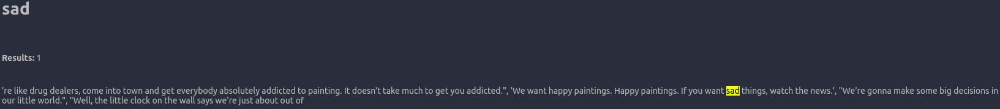
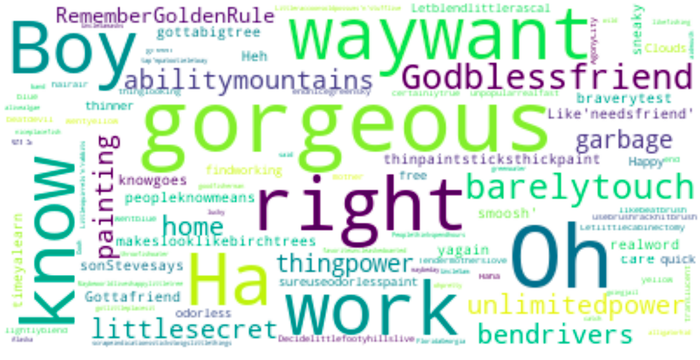

## Bob ross quotes analysis and nlp

---

### Database

#### Link: https://github.com/Dedsd/Bob-Ross-quotes-database
#### License: none

---

### Used libraries

- Spacy
- IPython
- Wordcloud
- Matplotlib
- Json
- Random

---

### Description

### This database shows several sentences by the painter Bob Ross.

```
"In painting, you have unlimited power. You have the ability to move mountains. You can bend rivers. But when I get home, the only thing I have power over, is the garbage."
```

---

### Loading modules and preparing the database

#### I loaded the module in English and also loaded the database in json. Then I transformed the database into the compatible format to proceed in the spacy lib.

---

### Systematization

#### Some systematization functions with nlp to test spacy on this database.

---

### Finding words and visualizing

#### The analysis starts to get more interesting. I will do a kind of "ctrl + f" on the database with spacy and IPython. Searching for the word "happy" we find 6 results. This helps to demonstrate that Bob Ross always tried to talk more about joy than sadness. The word "sad" appears only 1 time in the database, accompanied by Bob's cozy mood.



---

### Spacy classification

#### In this part I use spacy to do an entity recognition on the database. Although it is not completely accurate, it reminds us of important names present in the bob quotes. Like his son Steve and some cities including Alaska where Bob has lived.

```
"Oooh, if you have never been to Alaska (GPE) , go there while it is still wild. My favorite uncle asked me if I wanted to go there, Uncle Sam (PERSON). He said if you don't go, you're going to jail. That is how Uncle Sam (PERSON) asks you."
```

---

### Word cloud

#### In this part I render a nice word cloud where we can better analyze Bob's most quoted words. I create a new dataset where I remove the stop words, which are words that can get in the way during the analysis, such as: "what", "where", etc. With matplotlib we can see the image where we notice that "gorgeous" is the word that appears the most. We can also see other words like "rigth", "boy", ""unlimitedpower" etc. which reinforces the view that Bob encouraged that mistakes in painting don't matter as much as you're enjoying the moment and having fun.

